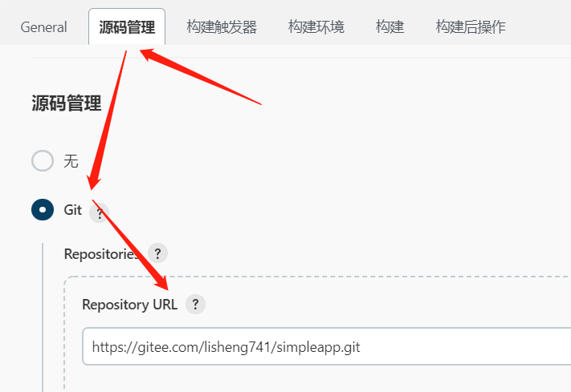
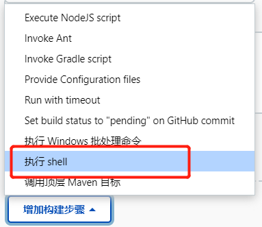
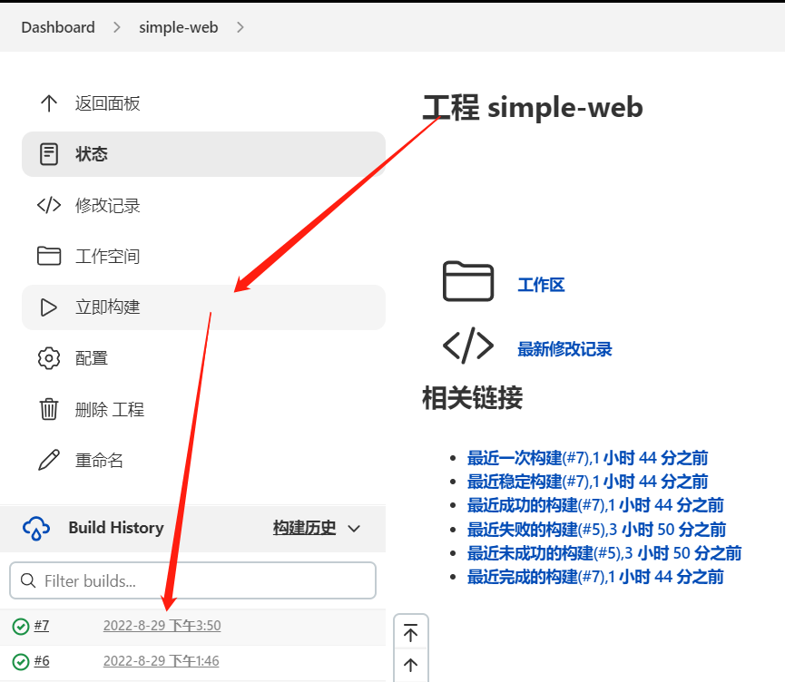
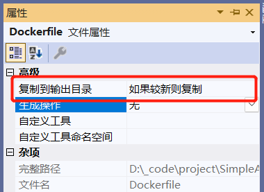

# jenkins 自动发布

说明：没有真的做成完全自动的发布，还是需要手工点一下才发布。


## 1 前端

参考[小诺文档：前端打包部署](https://doc.xiaonuo.vip/snowy_vue/deploy/)

### 1.1 环境

服务器：nginx

服务器需要安装 nodejs、npm、jenkins 等

### 1.2 配置流程

#### （1）新建文件夹

```bash
mkdir /data/simple/web
```

#### （2）修改 nginx 配置

进入配置文件：

```bash
vim /etc/nginx/nginx.conf
```

修改配置：

在 http 节点下，增加 server 节点，具体请参考[小诺文档：前端打包部署](https://doc.xiaonuo.vip/snowy_vue/deploy/)：

如下配置，监听 12060 作为前端的端口，转发 /api 路径请求到 12061 的后端接口。

```bash
http {
    server {
        listen       12060;

        # gzip config 前端加载慢问题这样解决
        gzip on;
        gzip_min_length 1k;
        gzip_comp_level 9;
        gzip_types text/plain application/javascript application/x-javascript text/css application/xml text/javascript application/x-httpd-php image/jpeg image/gif image/png;
        gzip_vary on;
        gzip_disable "MSIE [1-6]\.";

        server_name  localhost;  # 这里配置域名
        location / {
            root   "/data/simple/web";
            try_files $uri $uri/ @router;
            index  index.html index.htm;
            error_page 405 =200 http://$host$request_uri;
        }
        #代理后端接口
        location /api/ {
            proxy_pass http://localhost:12061/api/;   #转发请求的地址
            proxy_connect_timeout 6000;     #链接超时设置
            proxy_read_timeout 6000;        #访问接口超时设置
        }
        location @router {
            rewrite ^.*$ /index.html last;
            }
            error_page   500 502 503 504  /50x.html;
            location = /50x.html {
            root   html;
        }
    }
}
```

#### （3）登录 jenkins，新建任务

新建任务，命名为 simple-web

#### （4）配置 Git

源码管理 >> Git 配置 Repository URL：

https://gitee.com/lisheng741/simpleapp.git



#### （5）配置构建环境

增加构建步骤 >> 执行 shell



添加如下 shell 命令：

```bash
cd ./web
rm -rf nodemodules
npm i
npm run build
rsync -av --progress --delete $WORKSPACE/web/dist/  /data/simple/web
```

命令解释：

```bash
cd ./web # 进入 web 目录
rm -rf nodemodules # 删除 nodemodules 文件夹
npm i # 安装依赖
npm run build # 编译
rsync -av --progress --delete $WORKSPACE/web/dist/  /data/simple/web # 数据同步：将生成的文件同步到 /data/simple/web 目录下
```

### 1.3 发布

保存配置以后，点立即构建，即可发布




## 2 后端

后端以 docker 方式部署

### 2.1 配置流程

#### （1）新增 Dockerfile 文件

项目 Simple.WebApi 根目录下新增 Dockerfile 文件，内容如下：

```bash
FROM mcr.microsoft.com/dotnet/aspnet:6.0 AS base
COPY . /app
WORKDIR /app

ENV ASPNETCORE_URLS http://*:5000
ENV TZ Asia/Shanghai
EXPOSE 5000
ENTRYPOINT ["dotnet", "Simple.WebApi.dll"]
```

并设置文件属性：



#### （2）服务器下新增文件夹

```bash
mkdir /data/simple/webapi
```

#### （3）配置构建环境

```bash
cd ./webapi/Simple.WebApi
rm -rf $WORKSPACE/jenkins_publish
mkdir $WORKSPACE/jenkins_publish
dotnet publish --no-self-contained -r linux-x64 -c:Release -o $WORKSPACE/jenkins_publish
cd $WORKSPACE/jenkins_publish

docker stop simple-webapi
docker rm simple-webapi
docker rmi simple-webapi-img:1.0

docker build -t simple-webapi-img:1.0 .
docker run -d --name simple-webapi -p 12061:5000 -v /data/simple/webapi/logs:/app/Logs -v /data/simple/webapi/appsettings.json:/app/appsettings.json simple-webapi-img:1.0
```

